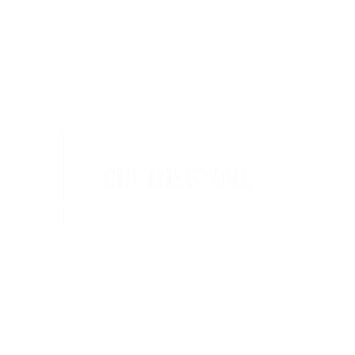
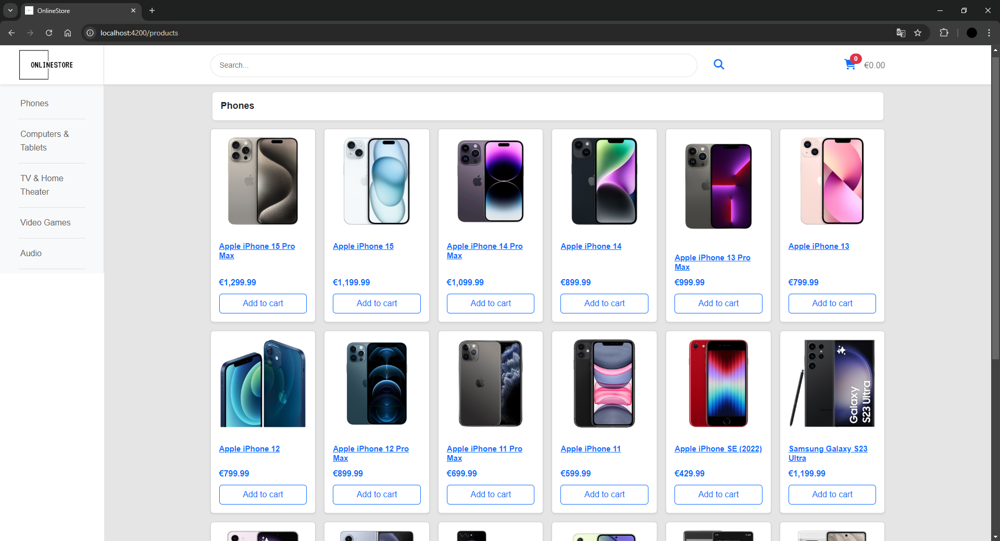
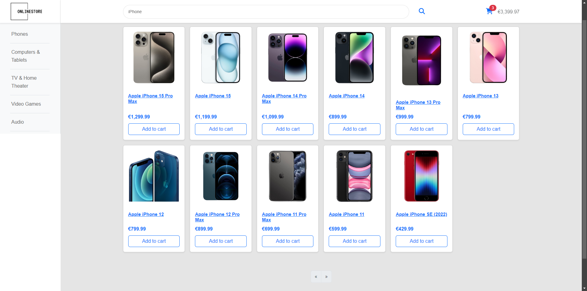
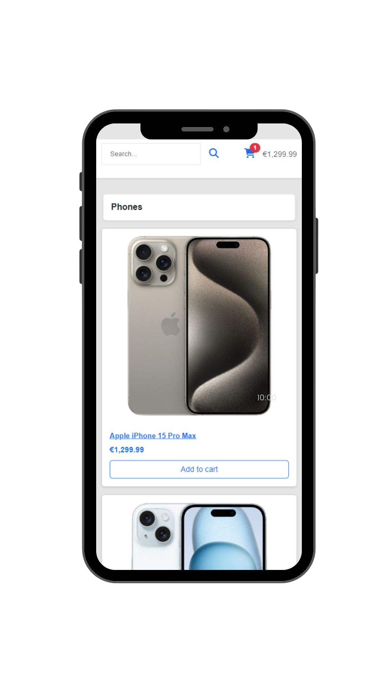
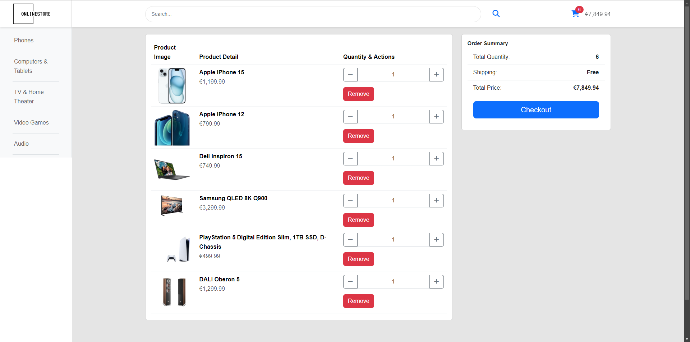

 

  

  <h3 align="center">OnlineStore</h3>

  

    Shopping website for tech enthusiasts.
     
    <a href="https://github.com/Bogdan016/OnlineStore"><strong>Explore the docs </strong></a>
  

## About The Project

OnlineStore is a streamlined and contemporary website designed to provide a simple, fast, and enjoyable shopping experience. It is crafted with the latest web technologies, catering to users who seek efficiency and ease in their online shopping endeavors.

### Why OnlineStore?

- **Simplicity at its Core**: Navigate, select, and purchase your favorite products with ease.
- **Speed You Can Feel**: Experience blazing-fast load times and quick response at every step.
- **Modern Aesthetics**: Enjoy a shopping environment that's not only functional but also visually appealing.

### Explore OnlineStore

#### Product Discovery

*Explore detailed product pages that provide everything you need to know about our items.*

#### Seamless Search

*Quickly find exactly what you're looking for with our intuitive search feature.*

#### Responsive Mobile View

*Shop on the go with our fully responsive mobile interface.*

#### Quick Cart Access

*Efficiently review and modify your selections in your shopping cart.*

#### Live Demo

*Watch a live demonstration of the site in action.*

(<a href="#readme-top">back to top</a>)

### Built With

This section outlines the core frameworks and technologies used in the project.

* 
* 
* 
* 
* 

(<a href="#readme-top">back to top</a>)

## Acknowledgments

* [**Angular Documentation**](https://angular.io/docs)
* [**Bootstrap Documentation**](https://getbootstrap.com/docs) 
* [**Spring Initializr**](https://start.spring.io/) 
* [**Stack Overflow**](https://stackoverflow.com/) 
* [**Postman**](https://www.postman.com/)
* [**Font Awesome**](https://fontawesome.com)

(<a href="#readme-top">back to top</a>)

